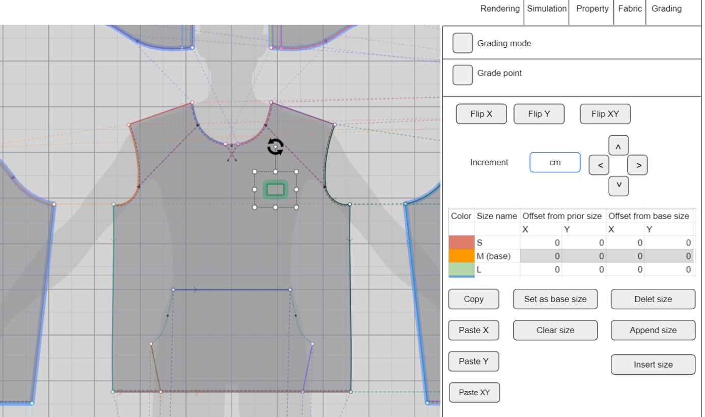
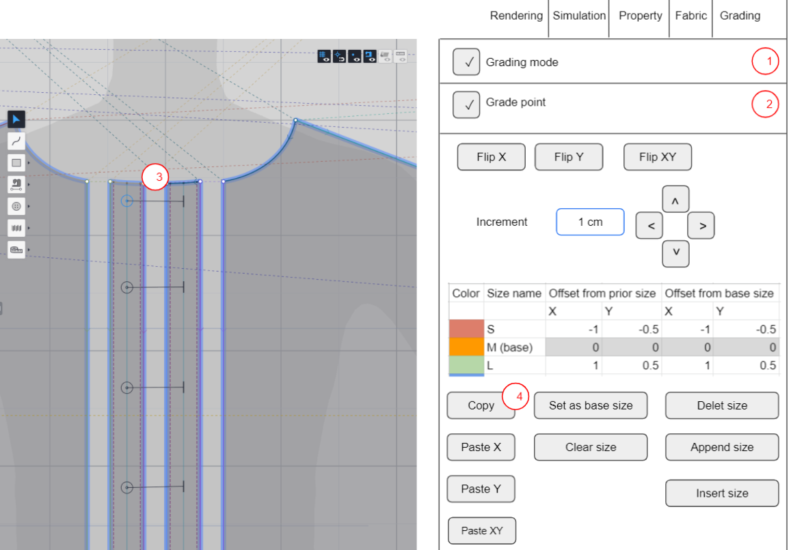

이 문서는?
=========

이 문서는 z-weave에 새로 추가될 그레이딩 시스템의 *기능* 명세서로, 주로 아래 내용을 다룹니다.

- 그레이딩 시스템이 무엇인지
- 사용자가 그레이딩을 수행할 때 할 수 있는 액션은 무엇이 있는지
- z-weave는 그런 사용자 액션에 대해서 어떻게 반응할 것인지

복잡한 기술적인 내용과 여러가지 코너 케이스는 *기술* 명세서에서 따로 다룹니다.
여기서 다루는 기능을 어떻게 테스트할 것인지는 테스트 계획서에서 다룹니다.


목차
====

- 개요
    - 그레이딩이란?
    - z-weave의 그레이딩 시스템
    - 용어 정의
- 화면 구성
    - Grading mode
    - Grade point
    - Flip
    - Increment
    - Size table
    - Copy & paste
    - Size management
- 유스케이스
    - DXF 불러오기
    - 내부선분 그레이딩
    - 로고
    - 버튼 & 홀
    - 시뮬레이션
- 시프팅
- 다른 기능과의 관계
    - Mirror
    - Flip
    - Scissor
    - Extend curve
- 상세명세


개요
====

그레이딩이란?
-----------

우리가 옷을 살 때 디자인과 재질만큼이나 중요한 것이 사이즈입니다.
사람마다 체형과 키가 달라서 누구에게는 S 사이즈가 맞고 다른 사람은 M 사이즈가 맞을 수도 있죠.
이렇게 같은 디자인이면서 다른 사이즈의 옷을 어떻게 만들까요?
언뜻 생각해보면 사이즈가 달라도 모양이 같으니까 기준이 되는 사이즈를 하나 정한 후 단순하게 그걸 1.05배 혹은 1.1배 늘리거나 줄여서 만들지 않을까 생각할 수도 있습니다.


물론 기준이 되는 사이즈가 하나 있고 거기서 다른 사이즈를 끌어내는 것은 맞는데, 일정하게 X 1.1로 늘리지는 않습니다.
예를 들면 허리와 가슴, 어깨 부분은 저마다 다른 비율로 늘어나고 늘어나는 방향도 서로 다릅니다. 아래 그림처럼요.


이렇게 하나의 기준 사이즈를 기반으로 조금씩 다른 패턴을 여러 벌 만드는 것을 그레이딩이라고 하며 단순히 전체 패턴을 균일하게 늘리는 것보다 훨씬 복잡한 작업을 필요로 합니다.


z-weave의 그레이딩 시스템
------------------------

z-weave는 사용자가 그레이딩 작업을 할 수 있게 여러 가지 기능을 지원하며 이를 묶어 그레이딩 시스템이라고 부릅니다.

- 사이즈 목록 관리: 사이즈를 추가하거나 삭제할 수 있고 S, M, L 같은 이름을 지정할 수 있습니다.
- 화면 출력: 여러 사이즈의 패턴을 사용자가 한눈에 비교할 수 있도록 합니다.
- 시프팅: 사용자가 패턴의 점을 마우스로 끌어서 원하는 만큼 크기를 늘릴 수 있습니다.


용어 정의
--------

- 기본 사이즈: 여러 사이즈 중에서 기준이 되는 사이즈를 가리킵니다. 다른 모든 사이즈는 기본 사이즈에서 파생되며 2D뷰와 3D뷰는 이 기본 사이즈에 맞춰 동작합니다.
- 패턴 베리에이션: 기본 사이즈 패턴에서 그레이딩으로 만들어 낸 새 패턴을 가리킵니다.
- 시프팅: 패턴에 속한 점을 사용자가 이동하는 작업을 가리킵니다.
- 그레이딩 모드: 사용자가 2D 뷰에서 시프팅을 수행하는 모드입니다. 그레이딩 모드에선 점을 추가하거나 패턴을 자르는 등의 편집을 할 수 없고 오직 시프팅만 가능합니다.
- 그레이드 포인트: 시프팅을 할 수 있는 점입니다. 사용자는 그레이드 포인트만 움직일 수 있습니다. 그레이드 포인트가 아닌 점은 주변의 그레이드 포인트에 맞춰 자동으로 - 위치가 결정됩니다.
- 오프셋: 사용자가 시프팅으로 두 점을 얼마나 떨어뜨렸는지 나타냅니다.
- 그레이딩 패널: 화면 오른편에 있는 패널로 사용자는 이 패널에서 사이즈 목록을 관리하고 시프팅을 수행할 수 있습니다.


화면 구성
========

사용자가 그레이딩 작업을 할 때 마주하는 주요 화면은 아래 그림과 같습니다.


그레이딩 패널은 화면 오른편에 위치하고 렌더링 패널이나 시뮬레이션 패널과 동일한 공간을 점유합니다.
시프팅은 따로 뷰를 마련하는 대신 2D 뷰 공간을 그대로 재활용합니다. 그레이딩 모드이냐 아니냐에 따라 일반 편집을 할지 시프팅을 할지를 결정합니다.


1 Grading mode
------------


그레이딩 모드로 진입하는 체크박스입니다.
체크박스가 켜지면 2D 뷰는 일반 편집이 금지되고 오직 시프팅만 수행하는 상태가 됩니다.
이 체크박스가 꺼져있을 경우 패널의 나머지 항목이 비활성화됩니다.


2 Grade point
-----------


선택한 점에 시프팅을 수행할지 말지 결정하는 체크박스입니다.
그레이딩 모드에선 그레이드 포인트와 그레이드 포인트가 아닌 점을 시각적으로 구분해서 표시합니다.

Set start point은 해당 점을 그레이딩의 원점으로 삼는 버튼입니다.
원점이 되면 모든 오프셋이 0이 되어서 모든 사이즈의 점이 선택한 점으로 모이는데 대신 사라진 오프셋만큼 다른 점에 오프셋을 더 주게 됩니다.
자세한 동작은 기술 명세에서 설명합니다.

3 Flip
----


4 Increment
-----------


사용자가 마우스로 점을 끌어서 위치를 맞추는 것이 편할 때도 있지만 상하좌우 방향으로 정확한 양만큼 이동하는 것이 필요할 때가 있습니다.
Increment는 이때 사용하는 것으로 얼마만큼, 그리고 어느 방향으로 이동할 것인지 지정할 수 있습니다.

5 Size table
------------


현재 몇 개의 사이즈가 있는지 지금 선택한 점이 각 사이즈 별로 얼마나 움직일 것인지 등을 나열하는 표입니다.
size table은 사이즈 별로 오프셋을 자유롭게 지정하고 싶을 때 특히 유용합니다.
왜냐하면 시프팅이나 Increment를 쓰면 모든 사이즈가 일정한 차이만큼 벌어지기 때문입니다.

현재 S, M, L, 총 3개의 사이즈가 있고 M이 기본 사이즈라고 가정하겠습니다.
시프팅이나 Increment를 썼을 때 S와 M이 1cm만큼 차이가 있다면 M과 L역시 1cm 차이가 납니다.
대부분 상황에선 이렇게 일정한 간격을 유지하는 것이 편하지만 M과 L의 차이를 1.5cm 나게끔 하고 싶을 수도 있습니다.
이런 경우에 사용자는 표에 값을 직접 써넣어서 오프셋을 각각 다르게 가져갈 수 있습니다.

6 Copy & paste
------------


Size table에 적힌 값을 그대로 복사해서 붙여넣을 수 있는 버튼입니다.
서로 다른 바운더리에 속하지만 사이즈가 변해도 똑같은 위치에 있어야 하는 두 점이 있을 때 편리하게 사용할 수 있습니다.


7 Size management
-----------------


새로운 사이즈를 추가/삭제하거나 기본 사이즈를 바꿀 때 사용합니다.
Set as base size는 선택한 사이즈를 기본 사이즈로 만듭니다.
Append size와 Insert size는 선택한 항목 뒤와 앞에 사이즈를 추가합니다.
Clear size는 사이즈를 삭제하는 것이 아니고 size table에 적인 모든 오프셋을 0으로 되돌립니다.


유스케이스
=========

사용자가 실제로 어떤 작업 흐름 속에서 그레이딩 시스템을 활용할지 그려보면 그레이딩 시스템의 동작을 더 잘 이해할 수 있습니다.
아래 유즈케이스는 가상의 시나리오이지만 대부분 사용자는 이와 비슷한 조건에서 작업을 수행하게 됩니다.


박둘리씨는 강남에서 근무하는 의상디자이너로 코버낫(주)에서 업무를 부탁받았습니다.
코버낫(주)에서 제공한 플리스 패턴을 z-weave에서 불러와서 옷을 만들고 시뮬레이션을 돌려 3차원 모델을 만드는 것이 박둘리씨의 임무입니다.


DXF 불러오기
-----------

플리스 패턴은 DXF 파일로 제공되고 같이 첨부된 RUL 파일에는 S, M, L 사이즈 정보가 담겨있습니다.
작업을 시작하기 위해 박둘리씨는 z-weave를 실행하고 DXF파일을 임포트합니다.
z-weave는 DXF과 대응하는 RUL 파일을 발견하고 여기서 그레이딩 정보를 읽어 들입니다. RUL 파일에는 다음과 같이 적혀있습니다.

```
SIZE LIST: S M L
SAMPLE SIZE: M
```

z-weave는 M 사이즈의 패턴을 불러와 2D 뷰에 보여줍니다.
화면에는 한 사이즈만 표시되지만 박둘리씨는 그레이딩 패널을 보고 DXF에 S, M, L 사이즈가 들어있었고 M이 기본사이즈임을 알아냅니다.


전체적인 패턴의 모양을 보기 위해 그레이딩 패널 상단의 Grading mode 버튼을 누릅니다.
그러면 2D뷰에는 아래 그림과 같이 서로 다른 색으로 표현된 패턴이 나타납니다.


모양을 확인했으니 다시 Grading mode 버튼을 눌러 편집모드로 돌아가 본격적인 작업을 시작합니다.


내부선분 그레이딩
------------

DXF패턴에는 쏘잉와 스티치, 로고가 없기 때문에 z-weave에서 만들어 주어야 합니다.


플리스 앞주머니는 해줘야 할 작업이 많이 있습니다.
일단 내부선분을 만들어야 합니다. "Offset to inner line" 메뉴로 아래 그림처럼 내부선분을 그려줍니다.
이 내부선분의 끝점은 앞주머니의 패턴이 커지거나 작아질 때 이에 맞춰 따라 움직이지 않습니다.
S 사이즈로 바꾸면 선분이 밖으로 삐져나오고 L 사이즈에서는 외각선 안으로 들어가 버립니다.
이를 방지하기 위해서 박둘리씨는 선분의 양 끝점을 그레이드 포인트로 바꾸기로 했습니다.
끝점을 선택하고 그레이딩 패널로 가서 Grading point를 선택합니다.
그러고 나서 끝점의 위치를 조정하기 위해 Grading mode로 진입합니다.


2D 뷰에는 주머니의 외각선이 사이즈별로 다른 색상으로 표시됩니다. 하지만 내부선분은 그레이딩정보가 없어서 하나로 표시됩니다.
박둘리씨가 2D뷰에서 선분의 끝점을 하나 선택한 후 마우스를 끌면 아래 그림처럼 점이 세개로 나뉩니다.


마우스를 움직이면서 각 끝점이 외곽선에 닿도록 맞춰 주고 버튼을 뗍니다. 이제 한쪽 점은 사이즈가 변하더라도 항상 외곽선에 붙어있게 됩니다.

반대쪽 점도 같은 방식으로 맞춥니다.


Grading mode에서 빠져나오고 이제 이 내부선분과 다른 패턴을 쏘잉으로 연결할 수 있습니다.

**작성자 노트: 내부선분을 이렇게 하나하나 편집해야 하는 것은 매우 번거롭습니다. 이를 피하려고 오프셋으로 만든 선분은 자동으로 사이즈에 맞게 변경되는 방식을 검토 중입니다.**

로고
----

박둘리씨는 앞주머니를 끝내고 나서 왼쪽 가슴에 로고이미지를 삽입하려고 합니다.
사이즈 변화폭이 작아서 로고의 크기가 바뀌지는 않지만, 로고의 위치는 사이즈마다 달라야 합니다.
로고의 위치를 조정하는 것은 선분의 점을 조정하는 것과 비슷합니다.
로고를 선택하고 그레이딩 패널로 이동하고 Grading point 항목을 선택합니다.



로고의 위치는 사이즈가 늘어날 때 정확히 1cm만큼 좌측으로 이동하는 것으로 약속이 되어있어서 박둘리씨는 마우스대신 그레이딩 패널의 Increment을 활용하기로 했습니다.
로고를 선택하고 Increment 항목에 1cm를 기입합니다. 그리고서 `>` 버튼을 누르면 S 사이즈는 -1만큼, L 사이즈는 1만큼 이동이 됩니다.


버튼 & 홀
--------

버튼과 버튼홀은 기본적으로 로고와 유사합니다. 다만 버튼은 하나만 달리는 경우는 드물고 여러 개가 일렬로 달리는 경우가 많습니다.
그리고 일렬로 달릴 때 그 간격은 사이즈에 상관없이 항상 일정한 경우가 많습니다.
이런 경우에 보통 2가지 방식을 쓸 수 있습니다.

1. 여러 개의 버튼을 선택해서 한 번에 오프셋을 지정하는 방식
2. 버튼 하나를 이동하고 오프셋값을 복사한 다음 나머지 버튼에 복사한 값을 붙여넣는 방식

박둘리씨는 2번 방식을 쓰기로 했습니다.
가장 위에 있는 버튼을 선택하고 그레이딩 패널로 갑니다.
그레이드 포인트로 설정한 후 그레이딩 모드로 전환합니다. 로고와 마찬가지로 버튼의 중심점을 끌어서 위치를 조정합니다.
이제 나머지 버튼과 버튼 홀을 전부 옮길 차례입니다.
일단 Copy를 눌러 현재 버튼의 오프셋값을 복사합니다.



관련된 모든 항목을 선택하고 그레이드 포인트로 지정합니다.
그리고 "Paste XY"를 눌러 오프셋값을 덮어씁니다.


값을 덮어쓰고 나면 모든 버튼과 버튼 홀이 같은 거리, 같은 방향으로 이동합니다.
그레이딩 모드를 종료하고 다시 편집모드로 돌아갑니다.

시뮬레이션
---------

모든 편집 작업이 끝나면 각 사이즈마다 시뮬레이션을 각각 돌려서 3D 모델을 만들어내야 합니다.
현재는 기본 사이즈는 M이기 때문에 2D 뷰와 3D 뷰 모두 M 사이즈를 보여줍니다.
박둘리씨는 S, M, L 사이즈 모두 시뮬레이션을 돌리고 결과를 저장하고 싶어합니다.

모든 패턴 베리에이션은 3D 위치가 같습니다.
거꾸로 이야기하면 한 사이즈에서 3D 위치를 조정하면 다른 사이즈에도 그대로 적용이 됩니다.
S 사이즈에서 패턴의 위치를 살짝 아래로 내리면 L 사이즈에서도 패턴이 내려갑니다.
아래 그림은 이해를 돕기 위해 만든 가상의 이미지로, 좌/우는 큰 패턴 베리에이션을 3D 공간에서 욺기기 전/후 모습입니다.
파란색으로 표시한 것이 작은 사이즈의 패턴입니다. 둘의 위치를 따로 지정할 수는 없고 항상 같이 움직입니다.


박둘리씨는 최적의 시뮬레이션 결과를 얻기 위해 사이즈를 바꿀 때마다 패턴 위치를 조금씩 조정하고, 시뮬레이션을 돌리고, 스냅샷을 각각 촬영합니다.
3D 뷰에서는 위치를 공유하지만 일단 스냅샷을 만들고 나면 스냅샷끼리는 서로 영향을 주지 않습니다.
M 사이즈에서 스냅샷-1을 만들고 L사이즈로 전환한 다음 위치를 바꾸더라도 스냅샷-1에는 영향을 주지 않습니다.

**작성자 노트: 각 사이즈마다 키나 가슴둘레 같은 아바타 설정을 따로 가져가고 사이즈를 바꿀 때 같이 바뀌는 기능은 이번 명세에 포함되지 않았습니다.**

시프팅
=====

시프팅은 그레이딩 시스템의 핵심으로 사용자가 패턴 베리에이션을 만들 때 점을 얼마만큼 이동할 것인지 지정하는 기능입니다.
사용자가 그레이딩 모드로 전환하면 2D뷰는 시프팅을 수행하는 공간으로 변화합니다. 이때는 새로운 패턴을 그리거나 쏘잉을 하는 등의 편집 기능은 못쓰게 됩니다.
시프팅은 화면에 표시된 그레이드 포인트를 사용자가 끌어서 바로 다음(혹은 이전) 사이즈가 얼마나 늘어나야 하는지를 지정하는 방식으로 동작합니다.


일단 인접한 사이즈가 얼마나 늘어날지 경정되면 다른 사이즈는 똑같은 거리를 서로 유지하도록 자동으로 벌어집니다.
예를 들어 M과 L의 거리가 2면 L과 XL의 거리도 2가 되고, XL과 XXL의 거리도 2가 됩니다.
만약 M과 L의 거리가 2이고 L과 XL의 거리가 3이 되야하는 경우에는 시프팅으로는 할 수 없습니다.
이럴때는 사이즈 테이블에서 직업 거리를 미세 조정해야합니다.

시프팅에서 중요한 제약 사항이 몇가지 있습니다.

1. 끌어서 움직일 수 있는 것은 기본 사이즈의 그레이드 포인트 뿐입니다.
2. 그레이드 포인트를 끌어 옮기려는 순간 이전에 시프팅했던 위치는 사라지고 처음부터 다시 시작합니다..

M이 기본 사이즈라고 할 때 사용자가 끌어서 움직일 수 있는 것은 M사이즈 뿐이며 L이나 XL의 점은 못움직입니다.
그레이드 포인트가 아닌 점은 인접한 그레이드 포인트에 맞춰 자동으로 위치가 결정됩니다. 사용자가 미세조정할 수는 없습니다.


**자동으로 위치가 결정되는 방식은 기술 명세서에서 자세히 설명합니다.**

이미 점 사이의 거리를 벌려놓은 상황에서 더 추가로 벌리거나 좁히는 것은 안됩니다. 점을 눌러 끄는 순간 모든 점이 한 곳으로 모이고 다시 시프팅을 시작하게 됩니다.
만약 현재 거리보다 더 넓게 벌리거나 좁히고 싶을 때는 Increment를 사용하거나 사이즈 테이블을 써야합니다.


다른 기능과의 관계
=================

그레이딩 시스템이 추가되면 z-weave 내부에 상당히 많은 변화를 가져옵니다.
왜냐하면 기존에는 여러 개의 사이즈가 존재할 가능성을 고려하지 않았기 때문입니다.
예를 들면 그레이딩 시스템이 추가되면 미러링을 수행할 때 패턴만 복제하는 것이 아니라 시프팅한 오프셋값을 모두 복제해야 합니다.
여기서는 이렇게 그레이딩 시스템이 기존 기능에 변화를 가져오는 부분에 관해서 설명합니다.

Mirror
------

미러링한 패턴은 원본 패턴뿐만 아니라 다른 패턴 베리에이션을 모두 수평으로 뒤집은 것과 같아야 합니다.


미러링한 패턴에서 그레이딩 값을 바꾸면 원본에도 똑같이 반영해야 합니다.

Flip
----

미러링과 비슷하게 패턴을 뒤집을 때도 모든 패턴 베리에이션을 뒤집어야 합니다.
수평으로 뒤집으면 오프셋의 X축 값을 반전해야 하고 수직으로 뒤집으면 Y축을 반전해야 합니다.


Scissor
-------

패턴을 자르면, 자르기 전의 패턴 베리에이션과 자른 후의 패턴 베리에이션 모양은 전체적으로 차이가 없어야 합니다.
다만 잘린 구역은 서로 다를 수 있으며 자세한 내용은 기술 명세서에서 설명합니다.


Extend curve
------------

Extend curve로 내부선분을 확장하면 끝점이 외곽선에 닿는데 이때 닿는 지점이 다른 사이즈에서 얼마만큼 이동하는지 알아내서 이 값을 끝점의 오프셋으로 설정해야 합니다.
